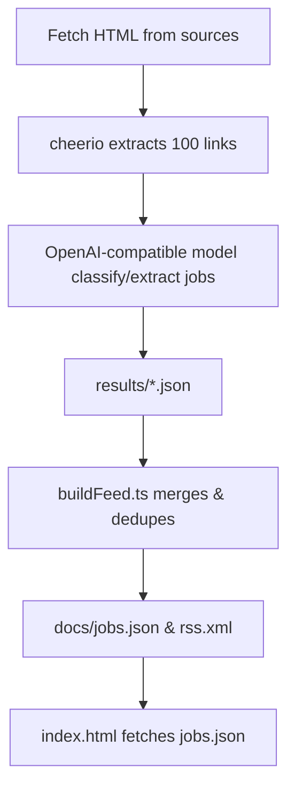

# AI Job Board – Design Specification

## 1. Overview
AI Job Board is a **zero-hosting-cost** job-feed generator and static job-board UI.  
It scrapes multiple job sources, lets GPT-4o-mini extract real job listings, deduplicates and merges them, then publishes:

* `docs/rss.xml` – RSS feed (latest 50 jobs)  
* `docs/jobs.json` – up to 500 recent jobs (JSON)  
* `docs/index.html` – responsive board UI  

GitHub Actions (cron) build & deploy to **GitHub Pages**; Bun CLI enables local runs.

---

## 2. Tech Stack

| Area                    | Choice                                | Notes |
|-------------------------|---------------------------------------|-------|
| Runtime                 | **Bun** (>=1.x)                      | Fast TS/JS runtime & bundler |
| Language                | **TypeScript** (ESNext targets)      | `tsconfig.json` in *bundler* mode |
| AI Model                | Mistral-small-latest (OpenAI-compatible) | Default model, efficient, outperforms GPT-4o-mini, cheaper |
| Web scraping            | `cheerio`                             | Lightweight DOM selector API |
| Validation              | `zod`                                 | Ensures schema of AI output |
| Feed generation         | `feed`                                | Builds RSS 2.0 |
| Lint/Format             | **Biome** (`biome.json`)             | Enforces style & rules |
| CI / Hosting            | **GitHub Actions** + **Pages**       | Workflow (not in repo excerpt) |
| OpenAI SDK              | OpenAI-compatible LLM backend (customizable endpoint/model) |

---

## 3. Directory & File Breakdown

| Path / File                       | Purpose |
|----------------------------------|---------|
| `.env.example`                   | Shows required env vars (`OPENAI_API_KEY`, supports `API_URL_BASE`, `API_MODEL`, defaults to Mistral) |
| `package.json` / `bun.lock`      | Dependency & script definitions |
| `tsconfig.json`                  | Compiler ↑ flags (strict, ESNext, noEmit) |
| `biome.json`                     | Formatting, linting config |
| `src/`                           | Application source |
| ├─ `crawler.ts`                  | Crawl single source via env vars. Uses `getOpenAIModel()` for custom endpoint/model. |
| ├─ `multi-crawl.ts`              | Crawl multiple hard-coded sources in parallel. Uses `getOpenAIModel()` for custom endpoint/model. |
| ├─ `openaiClient.ts`             | Returns a configured OpenAI model using env vars `API_URL_BASE` and `API_MODEL`. |
| ├─ `buildFeed.ts`                | Merge results → jobs.json + rss.xml + index.html |
| ├─ `server.ts`                   | Local dev server (`bun serve`) |
| └─ `test.ts`                     | Smoke test: crawl → feed build |
| `docs/` *(publish root)*         | Static site served by GitHub Pages |
| ├─ `index.html`                  | Client-side rendering of jobs.json |
| ├─ `jobs.json`                   | Generated job dataset |
| └─ `rss.xml`                     | Generated RSS feed |
| `docs/DESIGN_SPEC.md`            | **← you are here** |

---

## 4. Key Modules & APIs

### [`src/crawler.ts`](src/crawler.ts:17)
```ts
async function crawl(): Promise<void>
```
* Reads `SOURCE_URL`, `SOURCE_NAME`, `SELECTOR` from env.  
* Fetches HTML → extracts up to 100 link tuples (`text`, `href`, `context`).  
* Uses `generateObject` with `jobSchema` to let GPT-4o-mini return structured jobs.  
* Uses `getOpenAIModel()` to support custom endpoint/model.  
* Writes `results/{SOURCE_NAME}.json`.

### [`src/multi-crawl.ts`](src/multi-crawl.ts:87)
```ts
async function crawlAll(): Promise<void>
```
* Defines `sources[]` (Hacker News, WeWorkRemotely).  
* Runs `crawlSource()` (wrapper around `crawler` logic) in `Promise.allSettled`.  
* Uses `getOpenAIModel()` to support custom endpoint/model.  
* Summarises per-source counts.

### [`src/openaiClient.ts`](src/openaiClient.ts:1)
```ts
export default function getOpenAIModel(): OpenAIModel
```
* Returns an OpenAI model instance using `API_URL_BASE` and `API_MODEL` env vars.

### [`src/buildFeed.ts`](src/buildFeed.ts:26)
```ts
async function build(): Promise<void>
```
* Loads existing `docs/jobs.json` (if any) and new `results/*.json`.  
* Deduplicates by URL, fixes future dates, sorts desc.  
* Keeps max 500, adds top 50 to `Feed`.  
* Writes `docs/jobs.json`, `docs/rss.xml`, `docs/index.html`.

### [`src/server.ts`](src/server.ts:6)
Local Bun HTTP server (port 3000) serving generated `docs/*` with HMR for dev.

---

## 5. Data Flow



---

## 6. Standards & Conventions
* **Strict TS** with advanced safety flags.  
* Lint & format: Biome, tab indentation, double quotes.  
* ES modules (`type":"module"`).  
* Result JSON limited to 500 items, RSS = 50 items.  
* Environment variables drive single-crawl; multi-crawl config inline.

---

## 7. Build / Run / Deploy

### Installation
```bash
bun install
```

### Local Workflow
| Script (`bun run …`) | Action |
|----------------------|--------|
| `crawl`              | Single-source scrape (env required) |
| `multi-crawl`        | Crawl all predefined sources |
| `build`              | Generate feed & site (needs `results/*`) |
| `dev`                | `crawl` → `build` once |
| `full`               | Full pipeline then start server |
| `serve`              | Hot-reload local server (port 3000) |
| `test`               | Smoke test (`src/test.ts`) |

### GitHub Actions / Pages
* Scheduled workflow (`jobs-feed.yml`, not shown) runs:  
  `multi-crawl` → `build` → commit/push to `gh-pages` branch.  
* Pages serves `/docs` as the site root.  
* Secrets: `OPENAI_API_KEY` (required), GitHub automatically provides `GITHUB_TOKEN`.

---

## 8. Environment Variables

| Variable        | Used In              | Description |
|-----------------|----------------------|-------------|
| `OPENAI_API_KEY`| All crawlers         | OpenAI authentication |
| `API_URL_BASE`  | `openaiClient.ts`    | (Optional) Override the OpenAI API base URL (default: OpenRouter, for Mistral) |
| `API_MODEL`     | `openaiClient.ts`    | (Optional) Override the model name (default: `mistral-small-latest`) |
| `SOURCE_URL`    | `crawler.ts`, test   | URL of target job page |
| `SOURCE_NAME`   | `crawler.ts`, test   | Slug for output file |
| `SELECTOR`      | `crawler.ts`, test   | CSS selector for links |
| `GH_USER`       | `buildFeed.ts`       | GitHub username for absolute feed URLs |

---

## 9. Assumptions & Prerequisites
1. Bun runtime installed locally (or CI image provides it).  
2. Target pages allow scraping (no aggressive anti-bot).  
3. OpenAI-compatible model output conforms to `jobSchema` within token limits.  
4. GitHub Pages serves `/docs` folder (Pages source: *Deploy from branch* `gh-pages`).  
5. Additional sources can be added by editing `src/multi-crawl.ts` or using `crawl` with env vars.

---

### End of Document